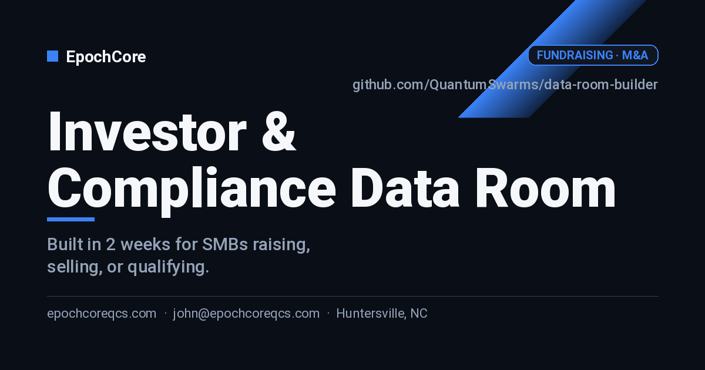

# Investor & Compliance Data Room

> A structured, defensible data room — built in 2 weeks — for SMBs raising capital, selling, or qualifying for enterprise contracts.

---

## Who this is for

SMB owners about to raise a round, sell the business, apply for an SBA loan, or respond to an enterprise procurement / vendor security review.

## What you get

- A complete data room (Notion, Google Drive, or Dropbox — your pick) organized to investor / acquirer / procurement standards.
- Every document version-controlled with an index page and last-updated dates.
- A redacted public version you can share before NDAs are signed.
- Pre-screened answers to the 50 most common diligence questions you'll be asked.

## Pricing

| Tier | Price | What's included |
|---|---|---|
| **Kickstart** | $3,500 | Structure + collection plan + index, you do the doc work. 1 week. |
| **Full Build** | $9,500 | We drive collection + drafting Q&A + redacted version + access control. 2–3 weeks. |
| **Concierge** | $1,800/mo | Ongoing data room maintenance during a live raise or M&A process. |

> Prices are starting points. Final scope confirmed in a free 30-min discovery call. Net-15 invoicing, 50% on signing for fixed-price tiers.

See [`docs/pricing.md`](./docs/pricing.md) for full breakdown, payment terms, and FAQ.

## Engagement timeline

- **Days 1–3** — Kickoff, structure, document inventory.
- **Days 4–10** — Collection sprints + Q&A drafting.
- **Days 11–14** — Redaction, access control, walkthrough, handoff.

Full engagement details in [`docs/scope.md`](./docs/scope.md) and [`docs/deliverables.md`](./docs/deliverables.md).

## How to engage

1. **Open an [Engagement Inquiry](../../issues/new?template=engagement-inquiry.yml)** — takes 2 minutes.
2. We respond within **1 business day** with a 30-min discovery call.
3. After the call, you get a written proposal in 48 hours.

Prefer email? **john@epochcoreqcs.com** with subject `[INQUIRY] data-room-builder`.

## About EpochCore

EpochCore LLC is based in **Huntersville, NC**, serving SMBs across the Charlotte / Lake Norman region (and remote nationally). Founder John has shipped infrastructure for quantum computing platforms, IBM Watson.x agents, and enterprise cloud — now bringing that engineering rigor to SMB consulting.

- 🌐 [epochcoreqcs.com](https://epochcoreqcs.com)
- 📧 john@epochcoreqcs.com
- 📍 Huntersville, NC

## Documentation

- [`docs/scope.md`](./docs/scope.md) — what's in and out per tier
- [`docs/pricing.md`](./docs/pricing.md) — full pricing, payment, FAQ
- [`docs/intake-checklist.md`](./docs/intake-checklist.md) — what we need from you at kickoff
- [`docs/deliverables.md`](./docs/deliverables.md) — concrete artifacts you receive
- [`SETUP.md`](./SETUP.md) — internal note for builders editing this repo
- [`CHANGELOG.md`](./CHANGELOG.md) — versioned changes to this offering

## License

This repository is **proprietary** and made public for marketing purposes only. See [`LICENSE`](./LICENSE).
